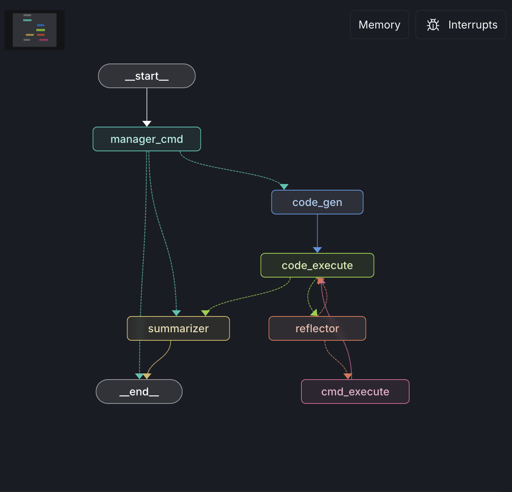

# Multi-Agent Data Analyst System

An intelligent multi-agent system for automated data analysis and visualization. Built with **LangGraph** for orchestration, **OpenAI** for reasoning, and **Daytona Sandbox** for secure, isolated code execution.

## 🚀 Setup & Run

**Note:** To run this system, you will need **3 essential API keys** set as environment variables:  
1. `OPENAI_API_KEY`  
2. `DAYTONA_API_KEY`  
3. `LANGSMITH_API_KEY`

Also set:
- `LANGSMITH_TRACING_V2=true`
- `LANGSMITH_PROJECT=<name>`


Follow these steps serially to get the system running.

```bash
# 1. Clone the repository to your local machine
git clone https://github.com/ABHAY4545/Multi-Agent-Data-Analyst-System.git
cd Multi-Agent-Data-Analyst-System

# 2. Create a virtual environment using uv
uv venv

# 3. Activate the virtual environment (Windows: .venv\Scripts\activate)
source .venv/bin/activate

# 4. Install all dependencies defined in pyproject.toml
uv sync

# 5. Initialize the Daytona Sandbox (Run this python snippet once to create the environment)
# This creates the 'CodeStore' sandbox and makes a 'charts' directory inside it.
python -c "
from daytona import Daytona, CreateSandboxFromSnapshotParams, CodeLanguage
params = CreateSandboxFromSnapshotParams(name='CodeStore', language=CodeLanguage.PYTHON)
sandbox = Daytona().create(params=params)
sandbox.process.exec('mkdir charts')
print('Sandbox initialized and charts directory created.')
"

# 6. Start the LangGraph development server to open LangSmith Studio
langgraph dev

```
# Graphical representation of the system architecture:

<p align="center">
  
</p>